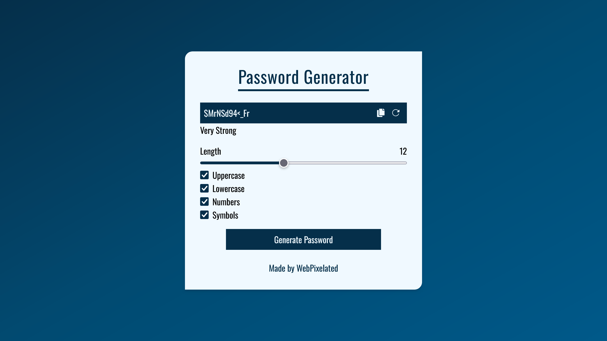

# Password Generator

My first practical project building a useful tool with TypeScript and Tailwind CSS.

## Key Features

- Customizable length
- Strength Indicator
- Responsive Design

## Screenshot



## Built With

- [React](https://reactjs.org/)
- [Vite](https://vite.dev/)
- [TypeScript](https://www.typescriptlang.org/)
- [TailwindCSS](https://tailwindcss.com/)

## Getting started

1. Clone the repository:

```bash
git clone https://github.com/WebPixelated/pract-passwordgenerator.git
```

2. Navigate to project repository:

```bash
cd pract-passwordgenerator
```

3. Install the dependencies:

```bash
npm install
```

4. Run the application:

```bash
npm run dev
```

5. Open `http://localhost:5173` in browser.

## Links

- Project URL: [Password Generator](https://github.com/WebPixelated/pract-passwordgenerator)
- Live Website URL: [Website](https://passgen-wpx.netlify.app/)
